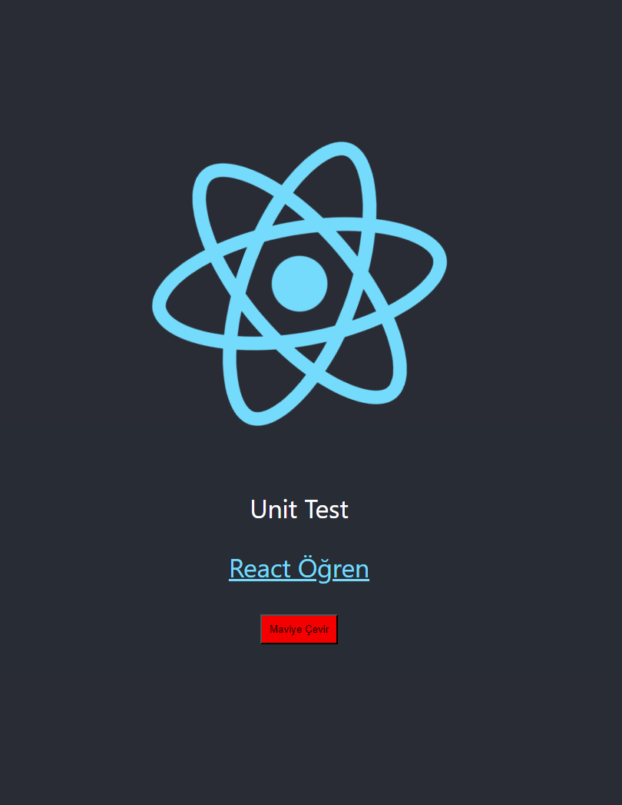

<h1>Unit Test Temeller</h1>

<h2>Expect</h2>

- Element'lerin veya verinin beklenen özelliklere sahip olup olmadığını kontrol etmemize yarar

- Element / veri 'den beklentimizi belirtmemiz için bazı fonksiyonlar sunar: Matchers

 <h2>Matchers</h2>

- Elementler / diziler / fonksiyonlar üzerinde beklentimizi kontrol eder. Element beklentimze uygunsa testi geçer değilse hata verir.

- https://jestjs.io/docs/using-matchers
- https://github.com/testing-library/jest-dom

<h2>Selector</h2>

- Render methodu ile sanal ortamda ekran bastığımız bileşnler içerisndeki elemenlları test etmek için çağırmamız gerekit. Bu işlemi seçici methodlar ile yaparız.

- Bu methodlar js'deki querySelector / getELementById ile aynı işlevi yapar

- https://testing-library.com/docs/queries/byrole

<h2>Roller</h2>

- Her html elemanın kendi rolu vardır

- Örn: "a" etiketinin html rolü "link" tir

- https://developer.mozilla.org/en-US/docs/Web/Accessibility/ARIA/Roles

<h2>Ekran Görüntüsü</h2>

